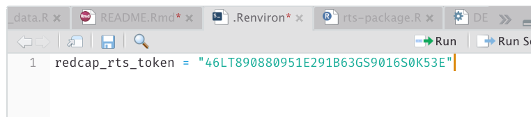

<!-- README.md is generated from README.Rmd. Please edit that file -->

```{r, include = FALSE}
knitr::opts_chunk$set(
  collapse = TRUE,
  comment = "#>",
  fig.path = "man/figures/README-",
  out.width = "100%"
)
```

# rts

<!-- badges: start -->
<!-- badges: end -->

The goal of rts is to get data from the [Return to School Project](http://returntoschoolproject.org/) into R in a variety of forms. It is designed for internal use for the project and not likely useful outside of the project.

## Installation

You can install the package from R via
``` r
# install.packages("remotes") # if not previously installed
remotes::install_github("datalorax/rts")
```

## Usage

You first need to have an API key for the specific project. You can save this in your `.REnviron`. This will end up looking something like the below (note, this is a fake token).



After you've completed this, you can download the raw data with the following code.

```{r example, message = FALSE}
library(rts)
d <- get_rts_data()

nrow(d)
ncol(d)
```

This is just the raw data, and not particularly useful, but future development will have it spit out the data for any survey and in a variety of different formats.
